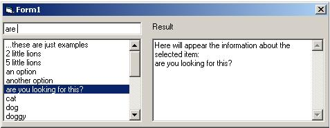



## Search ListBox

### Description

This is a very simple code to show how you could search a ListBox for an item dynamically by entering a word/phrase in a TextArea. Double clicking on an item at the List, will cause infos about it to appear at another TextArea. Feel free to use this code or parts of it for your applications :)
 
### More Info
 

             |
---                |---
**Submitted On**   |2001-12-07 15:33:36
**By**             |[George Ignatiadis](https://github.com/Planet-Source-Code/PSCIndex/blob/master/ByAuthor/george-ignatiadis.md)
**Level**          |Beginner
**User Rating**    |5.0 (10 globes from 2 users)
**Compatibility**  |VB 5\.0, VB 6\.0
**Category**       |[Miscellaneous](https://github.com/Planet-Source-Code/PSCIndex/blob/master/ByCategory/miscellaneous__1-1.md)
**World**          |[Visual Basic](https://github.com/Planet-Source-Code/PSCIndex/blob/master/ByWorld/visual-basic.md)
**Archive File**   |[SearchList400641272001\.zip](https://github.com/Planet-Source-Code/george-ignatiadis-search-listbox__1-29553/archive/master.zip)

